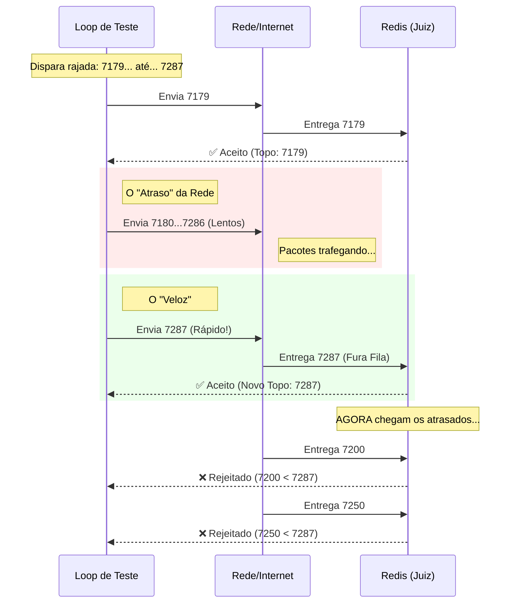
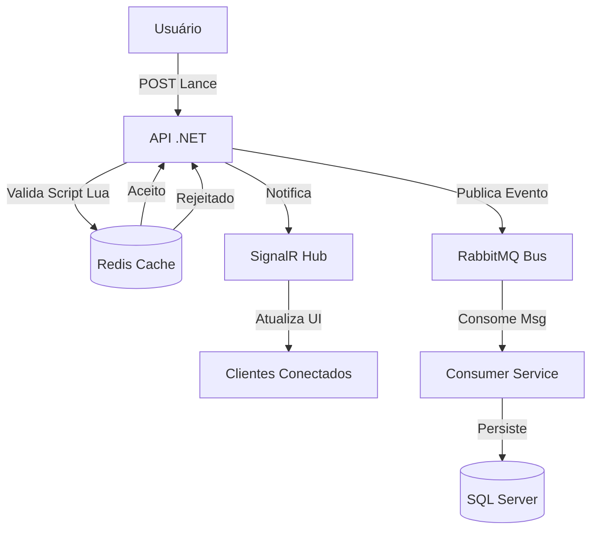

# 🔨 Leilão Tempo Real

Sistema de leilão em tempo real projetado para **alta concorrência** e **resiliência**.  
O projeto utiliza uma arquitetura orientada a eventos (**Event-Driven**) para garantir que lances sejam processados em milissegundos e persistidos com segurança, mesmo em caso de falhas críticas.


---
## 🧪 Cenário de Teste: Concorrência (Race Condition)

Para validar a robustez da arquitetura, realizei um teste de estresse simulando condições reais de rede, onde a ordem de chegada das requisições não é garantida.

**O Teste:**
- Disparo de 150 lances simultâneos.
- O sistema utilizou o **Redis** como "Gatekeeper" para filtrar lances menores que o atual.

**O Resultado:**
O diagrama abaixo ilustra como o sistema processou um "salto" de valor (de 7179 para 7287), rejeitando automaticamente as requisições atrasadas que traziam valores menores, garantindo a integridade do leilão.


## 🚀 Arquitetura e Fluxo de Dados

O sistema resolve o problema clássico de **race condition** (condição de corrida) em leilões disputados e garante **Zero Data Loss**.




---

## 🔄 Fluxo do Lance

1. **Entrada:** O usuário envia um lance via API.
2. **Validação Atômica (Redis):** Um **script Lua** garante atomicidade, validando:
   - Se o leilão está ativo  
   - Se o valor é maior que o lance atual  

   👉 Resultado em milissegundos (**sucesso** ou **Lance Baixo**).
3. **Real-time (SignalR):** Lances aceitos são enviados instantaneamente via WebSocket.
4. **Durabilidade (RabbitMQ):** Publicação do evento `LanceCriadoEvent`.
5. **Persistência Assíncrona:** Um consumer (`LanceCriadoConsumer`) grava os dados no **SQL Server**.

> **Destaque:** Se a API cair após a publicação do evento, o RabbitMQ mantém a mensagem até o processamento.  
> ✅ **Nenhum dado é perdido.**

---

## 🛠️ Tecnologias Utilizadas

### 🔹 Back-end (.NET 8)

- **ASP.NET Core Web API**
- **MassTransit** (RabbitMQ)
- **SignalR** (tempo real)
- **StackExchange.Redis**
- **Entity Framework Core**
- **xUnit & Moq**

### 🔹 Front-end (Angular)

🔗 [Acessar Repositório](https://github.com/leticiatakenaka/leticiatakenaka-leilaofront)

- **Angular 17+ (Standalone Components)**
- **RxJS**
- **SignalR Client**

### 🔹 Infraestrutura (Docker)

- **Redis**
- **RabbitMQ**
- **SQL Server**

---

## ⚙️ Como Rodar o Projeto

### Pré-requisitos

- Docker e Docker Compose
- .NET 8 SDK
- Node.js v18+ e Angular CLI

### 1️⃣ Subir a Infraestrutura

```bash
docker-compose up -d
```

### 2️⃣ Back-end

```bash
cd LeilaoTempoReal.API
dotnet run
```

📌 Swagger:  
`https://localhost:7101/swagger`

### 3️⃣ Front-end

```bash
npm install
ng serve
```

Acesse: `http://localhost:4200`

---

## 🧪 Testes

```bash
dotnet test
```

---

## 📂 Estrutura do Projeto

- `src/API`
- `src/Application`
- `src/Domain`
- `src/Infrastructure`
- `tests`

---

## 🛡️ Resiliência

- **Redis fora do ar?** O sistema trata a falha de conexão e evita inconsistência.
- **API crash?** Mensagens não processadas ficam em estado Ready no RabbitMQ e são retomadas automaticamente no reinício (graceful recovery).
- **Lance rejeitado?** UI atualizada em tempo real

---

Desenvolvido como **estudo de caso** para arquiteturas de **alta performance** em .NET.
